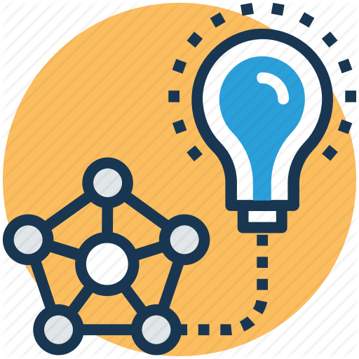

# ML-Resources

  

Deep Learning Resources
=============
## Motivation

The aim of this project is to provide a curated list of high-quality Deep Learning Resources that I have found valuable and insightful. These are organised into separate sections that can be seen in the Table of Contents below.

##### Table of Contents  
1. [Deep Learning Theory](#1)  
    * [Quick Intro](#s11)
    * [Beginner](#s12)
    * [Intermediate to Advanced](#s13)
2. [Computer vision](#2)  
    * [Classification](#s21)
    * [Object detection](#s22)
    * [Segmentation](#s23)
3. [Unsupervised learning](#3)
4. [Data Augmentation](#4)  
5. [Lectures & Tutorials](#5)  
6. [Explainable AI](#6)  
7. [Python & DL Cheatsheets](#7)  
8. [Cool DL examples & repos](#8)  
9. [AI newsletters & blogs](#9)

*First, a quick catch-up into the **State of the Art in Deep learning 2019**:*

* **MIT's Lex Fridman:** <https://www.slideshare.net/noumfone/deep-learning-state-of-the-art-2019-mit-by-lex-fridman>

* **Nathan Benaich:** <https://www.stateof.ai/>

<a name="1"/>

# 1.  Deep Learning Theory

  

<a href="https://towardsdatascience.com/the-keys-of-deep-learning-in-100-lines-of-code-907398c76504">Loss landscape</a>

This section will provide useful links for an introduction into core Deep learning concepts from begginer to advanced level.

* **Quick intro:**

  * **Deep learning in 100 lines of code:** <https://towardsdatascience.com/the-keys-of-deep-learning-in-100-lines-of-code-907398c76504>

* **Beginner level:**

  * **Stanford CS 231n CNNs class:**  <http://cs231n.stanford.edu/>

  * **Deep Learning Book by Ian Goodfellow, Yoshua Bengio and Aaron Courville:**  <http://www.deeplearningbook.org/>

  * **Stanford Deep Learing Tutorial:** <http://deeplearning.stanford.edu/tutorial/>

  * **Neural Networks and Deep Learning:** <http://neuralnetworksanddeeplearning.com/about.html>

  * **Chris Olah's personal github:** <http://colah.github.io/>

* **Intermediate to Advanced level**

  * **Imperial College London Deep learning Course (Jupyter notebook):** <https://github.com/MatchLab-Imperial/deep-learning-course/>

  * **Pattern Recognition and Machine Learning Book by Christopher M. Bishop:** <https://www.microsoft.com/en-us/research/people/cmbishop/#!prml-book>

  * **Fast AI:** <https://www.fast.ai/>

  * **Distill Pub for interpretable AI:** <https://distill.pub/>

  * **Chris Olah's github:** <http://colah.github.io/>

  * **Papers with code:** <https://paperswithcode.com/>

  * **Deep learning tricks:** <https://github.com/kmkolasinski/deep-learning-notes/blob/master/seminars/2018-12-Improving-DL-with-tricks/Improving_deep_learning_models_with_bag_of_tricks.pdf>

  * **NVIDIA Deep Learning examples**

    - **Pytorch** <https://github.com/NVIDIA/DeepLearningExamples/tree/master/PyTorch>

    - **Tensorflow** <https://github.com/NVIDIA/DeepLearningExamples/tree/master/TensorFlow>

<a name="2"/>

# 2. Computer vision

This section includes useful Github repositories to get going in training Computer vision algorithms.

* **Classification**

  - **ImageNet Top Board** <https://paperswithcode.com/sota/image-classification-on-imagenet>

  - **Keras model library** <https://github.com/keras-team/keras-applications/tree/master/keras_applications>

  - **Pytorch model library** <https://pytorch.org/docs/stable/torchvision/models.html>

  - **Efficient Net** <https://ai.googleblog.com/2019/05/efficientnet-improving-accuracy-and.html?m=1>

  - **Learning Semantic Boundaries from Noisy Annotations** <https://github.com/nv-tlabs/STEAL>

  - **Ensemble methods** <https://machinelearningmastery.com/ensemble-methods-for-deep-learning-neural-networks/>

  - **ADANet** <https://github.com/tensorflow/adanet>  

* **Object detection**

  - **Tensorflow Object Detection API** <https://github.com/tensorflow/models/tree/master/research/object_detection>

  - **Mask R-CNN** Pytorch: https://github.com/facebookresearch/maskrcnn-benchmark Keras: <https://github.com/matterport/Mask_RCNN>

  - **RetinaNet** Pytorch: <https://github.com/yhenon/pytorch-retinanet> Keras: <https://github.com/fizyr/keras-retinanet>

  - **YOLO v3** Pytorch: <https://github.com/ultralytics/yolov3> Keras: <https://github.com/qqwweee/keras-yolo3>

  - **RefineDet** Pytorch: <https://github.com/DrSleep/refinenet-pytorch> Keras: <https://github.com/Attila94/refinenet-keras>

  - **SNIPER** MXNet: <https://github.com/mahyarnajibi/SNIPER>

  - **M2Det** Pytorch: <https://github.com/qijiezhao/M2Det>

* **Segmentation**

  - **UNet** Pytorch: <https://github.com/milesial/Pytorch-UNet> Keras: <https://github.com/zhixuhao/unet>

  - **Attention U-Net** Pytorch: <https://github.com/LeeJunHyun/Image_Segmentation#attention-u-net>

  - **SegNet** Pytorch: <https://github.com/ZijunDeng/pytorch-semantic-segmentation> Keras: <https://github.com/divamgupta/image-segmentation-keras>

  - **DeepLab v3** Pytorch: <https://github.com/jfzhang95/pytorch-deeplab-xception> Keras: <https://github.com/bonlime/keras-deeplab-v3-plus>

  - **Reversible UNet** Pytorch: <https://github.com/RobinBruegger/PartiallyReversibleUnet>

  - **Fast Semantic Segmentation Network** Pytorch: <https://github.com/DeepVoltaire/Fast-SCNN>

* **Automatic Hyperparameter Search**

  - **Talos - automatic Hyperparameter tuning** <https://github.com/autonomio/talos>

  - **Fast prototyping with keras models** <https://github.com/maxpumperla/hyperas?source=post_page> & <https://github.com/hyperopt/hyperopt?source=post_page>

  - **Hyperparameter tuning magic from Francois Chollet** <https://twitter.com/fchollet/status/1141532631810527232?lang=en>

<a name="3"/>

# 3.  Unsupervised learning

* **GAN lab & visualisation** <https://poloclub.github.io/ganlab/>

* **Style GAN** <https://github.com/NVlabs/stylegan>

* **Compare GANs** <https://github.com/google/compare_gan>

* **Latent GAN** <https://github.com/SummitKwan/transparent_latent_gan#1-instructions-on-the-online-demo>

* **BigGAN** <https://github.com/ajbrock/BigGAN-PyTorch>

* **Vid2Vid** <https://tcwang0509.github.io/vid2vid/>

<a name="4"/>

# 4. Data Augmentation

This section consists in a list of data augmentation packages that can be used for model training for a more robust and generalizable model.

* **Albumentations: Data transformation & augmentation package in Numpy** <https://github.com/albu/albumentations>

* **Python library for augmenting images** <https://github.com/aleju/imgaug>

* **Augmentor: image augmentation library in Python for machine learning** <https://github.com/mdbloice/Augmentor>

* **1000x Faster Data Augmentation from Berkeley Artificial Intelligence Research (BAIR)** <https://bair.berkeley.edu/blog/2019/06/07/data_aug/>

* **AutoAugment: Learning Augmentation Policies from Data** <https://github.com/DeepVoltaire/AutoAugment>

<a name="3"/>

<a name="5"/>

# 5. Lectures or tutorials

This section includes livestreams of TOP AI conferences or DL tutorials.

* **ICML IJCAI ECAI 2018 Conference Videos** <https://www.youtube.com/channel/UCvqEpkx-HQ2nDMT-ob-AADg/videos>

* **The Artificial Intelligence Channel** <https://www.youtube.com/user/Maaaarth>

* **NVIDIA Developer** <https://www.youtube.com/user/NVIDIADeveloper>  

* **CVPR lectures/tutorials** <https://www.youtube.com/channel/UC0n76gicaarsN_Y9YShWwhw/videos>

* **Google Developers** <https://www.youtube.com/user/GoogleDevelopers>

* **CogX** <https://www.youtube.com/channel/UCvL4EwcLAGbAvCvwKOzDEpw>

* **RAAIS** <https://www.youtube.com/channel/UCL78WE5txuSu94gY5qrvU8w/featured>

* **Lex Fridman's AI Podcast** <https://www.youtube.com/user/lexfridman>

* **ARXIv Insights** <https://www.youtube.com/channel/UCNIkB2IeJ-6AmZv7bQ1oBYg/videos>

* **ICML 2019 notes** <https://david-abel.github.io/notes/icml_2019.pdf>

* **All posters from ICML 2019** <https://postersession.ai/>

<a name="6"/>

# 6. Explainable AI

This section has a selection of python packages that try to make DL model outcomes more explainable.

* **Seldon - Alibi** <https://github.com/SeldonIO/alibi>

* **XAI - an explainability tool for machine learning maintained by The Institute for Ethical AI & ML** <https://github.com/ethicalml/xai>

* **Deepmind's blog on Robust and Verified AI** <https://deepmind.com/blog/robust-and-verified-ai/>

* **Microsoft python package for training interpretable models and explaining blackbox systems** <https://github.com/microsoft/interpret>

* **Adversarial Robustness Toolbox** <https://github.com/IBM/adversarial-robustness-toolbox>

* **Ludwig - a toolbox that allows to train and test deep learning models without code** <https://uber.github.io/ludwig/>

* **SHAP - a unified approach to explain the output of any machine learning model** <https://github.com/slundberg/shap/blob/master/README.md>

* **Anatomy of an AI system: The Amazon Echo as an anatomical map of human labor, data and planetary resources** <https://anatomyof.ai/>

* **Sanity Checks for Saliency Maps NeurIPS Paper** <https://papers.nips.cc/paper/8160-sanity-checks-for-saliency-maps.pdf>

* **DeepExplain: attribution methods for Deep Learning** <https://github.com/marcoancona/DeepExplain>

* **IBM fairness AI** <https://aif360.mybluemix.net/>

<a name="7"/>

# 7.  Python & ML Cheatsheets

* **Great talk about Expert-level python tricks & concepts from PyData:** <https://www.youtube.com/watch?v=cKPlPJyQrt4>

* **Python tips:** <http://book.pythontips.com/>

* **AI cheatsheets:** <https://github.com/kailashahirwar/cheatsheets-ai>

* **Python 3 Tricks** <https://datawhatnow.com/things-you-are-probably-not-using-in-python-3-but-should/>

<a name="8"/>

# 8.  Cool DL examples & repos

This section includes some cool models, tricks and miscellaneous DL Github repos.

* **Kito - a Keras inference time optimizer** <https://github.com/ZFTurbo/Keras-inference-time-optimizer>

* **How to fit any dataset with a single parameter** <https://github.com/Ranlot/single-parameter-fit>

* **A Recipe for Training Neural Networks** <https://karpathy.github.io/2019/04/25/recipe/>

* **LyreBird** <https://myvoice.lyrebird.ai/g/syr6339vkf>

* **Activation Atlases** <https://github.com/PolyAI-LDN/conversational-datasetshttps://blog.openai.com/introducing-activation-atlases/>

* **BERT** <https://github.com/huggingface/pytorch-pretrained-BERT>

* **Similarity visualisation** <https://github.com/GWUvision/Similarity-Visualization>

* **Deep painterly harmonization** <https://github.com/luanfujun/deep-painterly-harmonization#>

* **AI playground** <https://www.nvidia.com/en-us/research/ai-playground/?ncid=so-twi-nz-92489>

* **BigGAN generation with TF Hub** <https://colab.research.google.com/github/tensorflow/hub/blob/master/examples/colab/biggan_generation_with_tf_hub.ipynb#scrollTo=Cd1dhL4Ykbm7>

* **Learning resources** <https://sgfin.github.io/learning-resources/>

* **Snorkel** <https://hazyresearch.github.io/snorkel/>

* **Deep image prior** <https://dmitryulyanov.github.io/deep_image_prior>

* **Sherpa** <https://github.com/LarsHH/sherpa>

* **DL recommendation model** <https://venturebeat.com/2019/07/02/facebook-open-sources-dlrm-a-deep-learning-recommendation-model/>

* **3D deep learning from BMVA** <https://bmva.weebly.com/20th-feb-deep-learning-in-3d.html?platform=hootsuite>

<a name="9"/>

# 9. AI newsletters & blogs

This section includes some newsletters and personal blogs I have found interesting and worth reading.

* **Nathan.ai By Nathan Benaich** <http://newsletter.airstreet.com/>

* **Exponential view by Azeem Azhar** <https://www.exponentialview.co/>

* **Andrej Karpathy** <http://karpathy.github.io/>

* **Chris Olah** <http://colah.github.io/>

* **OpenAI** <https://openai.com/blog/>

* **Google Research Blog** <https://ai.googleblog.com/>
